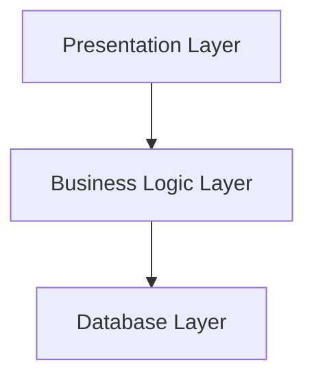

# Domain Modeling

### Domain Model

The Domain Model is used in business logic layer to describe the central layer of three-layered architecture. 

**The three-layers is:** 

* **Presentation:** Show interface to user and interprets inputs (Ex: front-end).
* **Business:** Process the logic of business applying rules and behaviors.
* **Data:** Manage data persistence and communication with the storage layer.

#  

